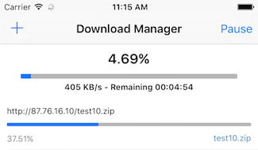

### Downloader Cordova Download Plugin

Cordova plugin for downloading files from server.

### Supported Platforms

- Android
- iOS

### Installation

This requires Phonegap / Cordova CLI 3.0 +

- Cordova CLI

```sh
cordova plugin add https://github.com/Whebcraft/cordova-plugin-downloader
```


- Phonegap Build

```sh
    <plugin spec="https://github.com/Whebcraft/cordova-plugin-downloader.git" source="git" />
```

### Usage Android

```js
var Downloader = window.plugins.Downloader;

var downloadSuccessCallback = function(result) {
       // result is an object
        {
            path: "file:///storage/sdcard0/documents/My Pdf.pdf", // Returns full file path
            file: "My Pdf.pdf", // Returns Filename
            folder: "documents" // Returns folder name
        }
       console.log(result.file); // My Pdf.pdf
};

var downloadErrorCallback = function(error) {
    // error: string
};

var options = {
    title: 'Downloading File', // Download Notification Title
    url: "http://www.website.com/file.pdf", // File Url
    path: "My Pdf.pdf", // The File Name with extension
    description: 'The pdf file is downloading', // Download description Notification String
    visible: true, // This download is visible and shows in the notifications while in progress and after completion.
    folder: "documents" // Folder to save the downloaded file, if not exist it will be created
}

Downloader.download(options, downloadSuccessCallback, downloadErrorCallback);
```


### Usage iOS

```js
var Downloader = window.plugins.Downloader;

var downloadSuccessCallback = function(folder) {
       // folder: string where the file has been downloaded
};

var downloadErrorCallback = function(error) {
    // error: string
};


var options = {
    url: "http://87.76.16.10/test10.zip", // File Url
    path: "test10.zip", // The File Name with extension
}

Downloader.download(options, downloadSuccessCallback, downloadErrorCallback);
```


### Get download folder

The file will be downloaded within the device storage not SdCard.(Android)

WARNING: `will overwrite existing file if it already exists.`

License
--------

    Licensed under the Apache License, Version 2.0 (the "License");
    you may not use this file except in compliance with the License.
    You may obtain a copy of the License at

    http://www.apache.org/licenses/LICENSE-2.0

    Unless required by applicable law or agreed to in writing, software
    distributed under the License is distributed on an "AS IS" BASIS,
    WITHOUT WARRANTIES OR CONDITIONS OF ANY KIND, either express or implied.
    See the License for the specific language governing permissions and
    limitations under the License.